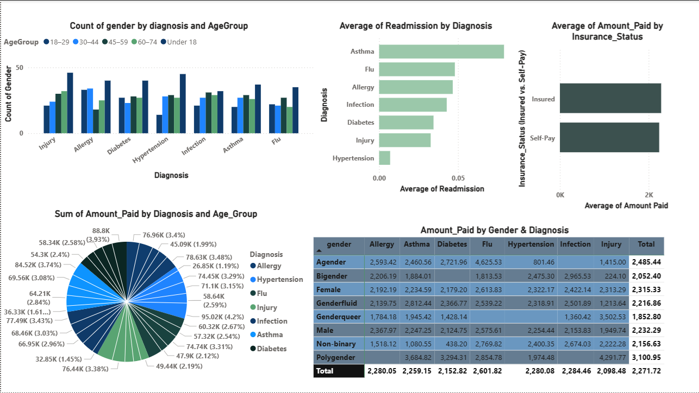

# **Patient Demographics, Readmission Rates, and Financial Insights Analysis**

## Table of Contents
* [1. Project Overview](#1-project-overview)
* [2. Data Source](#2-data-source)
* [3. Objectives](#3-objectives)
* [4. Project Structure](#4-project-structure)
* [5. Dataset Details](#5-dataset-details)
* [6. Hypothesis](#6-hypothesis-and-key-findings)
* [7. Power BI Visuals](#7-key-findings--hypothesis-power-bi-visuals)
* [8. Key Insights](#8-Key-Insights)
* [9. Detailed Analysis Report](#9-Detailed-Analysis-Report)
* [10. Technologies Used](#10-technologies-used)
* [11. Setup and Installation](#11-setup-and-installation)
* [12. Contact](#12-contact)

## Project Overview

This report presents a preliminary analysis of patient demographics, readmission rates, and financial outcomes, leveraging five interactive Power BI visuals. The analysis focuses on understanding patient distribution across diagnoses, age groups, and gender; identifying diagnoses with elevated readmission rates; and dissecting the financial burden by diagnosis, age, gender, and insurance status. Key findings indicate that Asthma and Flu diagnoses are associated with higher readmission averages, while certain diagnoses like Diabetes and Hypertension contribute significantly to total costs. A notable financial disparity exists for self-pay patients. These insights are critical for targeted interventions and strategic resource allocation.

## Data Source

The data for this analysis was created using Mackaroo. Few columns were added later on using Python. They are: age, age group, days_since_last_visit & readmission.

## Objectives

The primary objectives of this analysis are to:
•	Understand the demographic composition of the patient population, specifically gender distribution across diagnoses and age groups.
•	Identify diagnoses associated with higher average readmission rates.
•	Analyze the financial burden across different diagnoses, age groups, gender, and insurance statuses.
•	Formulate testable hypotheses based on observed patterns for further investigation and strategic planning.

## Project Structure

| Folder        | File / Subfolder                  | Description                                               |
|---------------|-----------------------------------|-----------------------------------------------------------|
| data      | `raw/`                            | Original uncleaned CSV files: patients, doctors, visits, billing |
|               | `cleaned/`                        | Cleaned versions of CSV files                             |
|               | `final_dataset.csv`               | Final merged dataset with new columns                     |
| diagrams  | `schema_EDR1`                     | Entity-Relationship schema diagram                        |
| dashboards| `hospital_dashboard`              | Power BI report with all visuals                          |
| logs      | `pipeline_log.ipynb`              | Timestamped logs of pipeline execution steps              |
| notebooks | `01_clean_patients.ipynb`         | Cleaning patient data                                     |
|               | `02_clean_doctors.ipynb`          | Cleaning doctor data                                      |
|               | `03_clean_visits.ipynb`           | Cleaning visit records                                    |
|               | `04_clean_billing.ipynb`          | Cleaning billing data                                     |
|               | `05_integrate_data.ipynb`         | Merging datasets into final form                          |
|               | `06_validate_data.ipynb`          | Validating final dataset                                  |
| scripts   | `run_pipeline.py`                 | Python script to execute the complete data pipeline       |
| README.md |                                   | This documentation file                                   |

---

## Dataset Details

| Column Name      | Description                              |
|------------------|------------------------------------------|
| patient_id       | Unique identifier for each patient       |
| date_of_birth    | Patient's birth date                     |
| visit_date       | Date of hospital visit                   |
| gender           | Male/Female                              |
| diagnosis        | Primary diagnosis                        |
| doctor           | Treating doctor (not used in visuals)    |
| amount_paid      | Total bill paid by the patient           |
| payment_type     | Insurance / Self-paid                    |
| readmission_rate | Number of times the patient returned     |
| days_since_last_visit| Number of days since patient's last visit|
| age              | Calculated based on visit_date - DOB     |
| AgeGroup         | Categorized age range (Under 18 to 75+)  |

---

## Hypothesis

`final_dataset.csv`
- The distribution of patients by gender, across different diagnoses and age groups, reveals specific demographic risk patterns, and tendencies for certain conditions, helping identify which groups are more affected and influencing healthcare demands.
- Specific diagnoses are significantly correlated with higher average readmission rates, suggesting possible issues in treatment indicating potential gaps in post-discharge care or disease management for these conditions.
- The total amount paid varies by diagnosis, and these costs differ further across different age groups.
- While some diagnoses will have similar costs across different gender categories, others may show notable financial disparities due to varying prevalence, treatment pathways, or disease severity.
- Patients without insurance (Self-pay) will incur a significantly higher average amount paid compared to insured patients, highlighting disparities in pricing structures or negotiated rates.

---

## Power BI Visuals

| Visual Name                          | Description |
|-------------------------------------|-------------|
| Count of Gender by Diagnosis and Age Group | Column chart shows the diagnosis in different age groups & genders |
| Average of Readmission by Diagnosis | Bar chart compares which diagnoses are linked to higher readmission rate
| Sum of Amount Paid by Diagnosis and Age_Group | Pie-chart shows amount paid varies by diagnosis in different age groups|
| Amount Paid by Gender & Diagnosis   | Matrix of costs for the diagnosis and different genders |
| Avg. Amount Paid by Insurance_Status| Bar chart compares average amount paid by payment type |

---

## Key Insights

1- Patient Demographics by Diagnosis & Age Group

- Middle-aged and older adults (ages 45–74) are the largest patient cohorts across most diagnoses, especially for chronic conditions like Hypertension and Diabetes.

- Younger age groups (18–29) are more commonly affected by Allergies and Infections.

Children (under 18) show minimal representation, except in Infections, suggesting age-specific health risks.

2- Readmission Rates by Diagnosis

- Asthma and Flu have the highest average readmission rates, indicating a need for better post-discharge care and follow-up.

- Hypertension and Diabetes show low readmission rates, suggesting effective ongoing management.

- Allergy and Infection fall in the middle, with moderate readmission levels.

3- Healthcare Cost Distribution by Diagnosis & Age

- Diabetes and Hypertension are the top cost drivers, especially in older age groups.

- Asthma, Injury, and Infection also contribute significantly to total healthcare spending.

- Chronic conditions in older adults are the most financially burdensome, while Asthma-related costs are spread more evenly across age groups.

4- Gender-wise Cost Analysis

- Polygender, Male, and Agender categories show higher total healthcare costs, especially for Flu and Hypertension.

- Flu and Hypertension are the most financially significant diagnoses across most gender categories.

- Some underrepresented genders (e.g., Genderqueer, Non-binary) still show notable costs for select conditions, like Injury and Infection.

Insight: Gender diversity should be considered in health resource planning and financial support strategies.

5- Insurance vs. Self-Pay Cost Differences

- Self-pay patients pay significantly more on average (~$1.9K vs. $1.7K for insured), suggesting financial vulnerability due to lack of negotiated rates.

- This emphasizes the need for financial assistance programs or equity-focused policies to support uninsured individuals.

---

## Detailed Analysis Report

For a deeper dive into insights, visual interpretations, and hypotheses testing:

[Read Full Analysis Report](./docs/analysis.md)

---

## Tools & Technologies

- Microsoft Power BI Desktop (visuals and modeling)
- Python (for age calculation, optional preprocessing)
- CSV dataset

---

## How to Use

1. Open Power BI Desktop
2. Load `final_dataset.csv` or open `PowerBI_Report.pbix`
3. Explore visuals interactively
4. Adjust filters or slicers to dive into gender/age/payment insights

---

## Author
Syeda Safvi 
